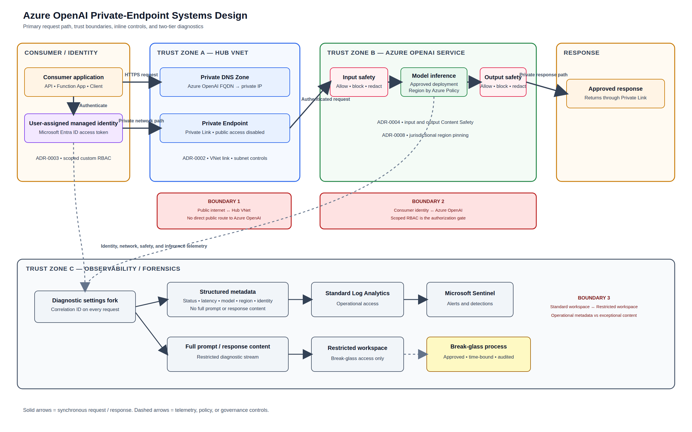

# Architecture Overview — Secure GenAI Integration Platform

## Business problem
An enterprise (bank, telco) wants to adopt GenAI for a real workflow, but security and
compliance will not sign off without three things: a data residency guarantee, a
documented defence against prompt injection and data exfiltration, and full audit
logging of every prompt and response. This pattern demonstrates how those three
requirements are satisfied together, using Azure OpenAI as the model platform
([ADR-0001](../adr/0001-platform-choice-azure-openai-vs-bedrock.md)).

## Component overview

| Component | Azure Service | Purpose | Why not the alternative |
|---|---|---|---|
| Model endpoint | Azure OpenAI Service | Hosts the LLM behind a private endpoint | AWS Bedrock offers broader model choice, but ties this pattern to a second identity/governance substrate ([ADR-0001](../adr/0001-platform-choice-azure-openai-vs-bedrock.md)) |
| Network boundary | Private Endpoint + Private DNS Zone | Removes the public endpoint entirely | VNet injection is not supported for Cognitive Services resources ([ADR-0002](../adr/0002-private-networking-pattern.md)) |
| Identity | User-assigned managed identity + custom RBAC role | Authenticates callers without standing credentials | The built-in `Cognitive Services OpenAI User` role is broader than a defensible least-privilege claim ([ADR-0003](../adr/0003-identity-and-rbac-model.md)) |
| Content filtering | Azure AI Content Safety | Filters prompts and completions, detects injection attempts | A custom domain-specific filter is real engineering effort, deliberately deferred ([ADR-0004](../adr/0004-content-filtering-strategy.md)) |
| Audit logging | Log Analytics (metadata) + restricted workspace (full content) | Satisfies audit requirements without duplicating sensitive data into an unrestricted store | Logging full content everywhere by default creates a second exposure surface ([ADR-0005](../adr/0005-audit-logging-and-data-retention.md)) |
| Alerting | Microsoft Sentinel | Surfaces anomalies from the metadata log | — |
| Region/residency control | Azure Policy (region restriction) | Enforces data residency as a technical control, not a documentation promise | A documented promise is not enforceable; policy-as-code is ([ADR-0008](../adr/0008-data-residency-constraint.md)) |

## Worked examples: data residency
Two concrete regulatory scenarios illustrate how the same pattern applies across
jurisdictions relevant to this portfolio's target markets:

**Nigerian client under NDPR (Nigeria Data Protection Regulation):** the Azure OpenAI
deployment and both Log Analytics workspaces are pinned to a region approved for the
client's NDPR obligations via the region-restriction policy
([ADR-0008](../adr/0008-data-residency-constraint.md)).

**UK client under UK GDPR:** the same policy mechanism pins the deployment to a UK
region instead — the infrastructure pattern is identical; only the policy's approved
region parameter changes.

## What this pattern does not cover
- Application-layer business logic for whatever consumes this endpoint
- Fine-tuning or retrieval-augmented generation (see the threat model's scope note)
- Tool-calling implementation — the permission boundary is defined
  ([ADR-0007](../adr/0007-tool-calling-permission-boundary.md)) but no tool-calling
  exists in this pattern's baseline scope
- Legal or regulatory certification — the region-pinning control is necessary but not
  sufficient for compliance sign-off; that requires client-specific legal review

## Related work
This pattern builds on identity and networking patterns established in
[multicloud-zero-trust-landing-zone](https://github.com/oyeniffy/multicloud-zero-trust-landing-zone),
and its cost/budget controls extend the patterns in
[azure-cloud-governance-finops-platform](https://github.com/oyeniffy/azure-cloud-governance-finops-platform).

See the [full threat model](../threat-model/llm-threat-model.md) for the security
analysis underlying these architectural choices.
